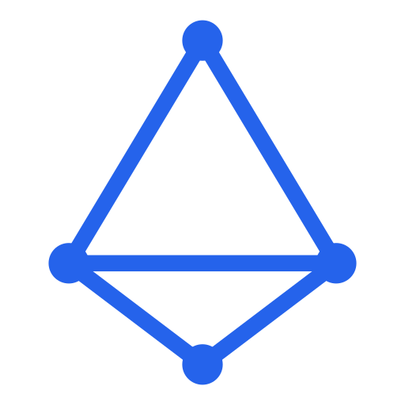

# Examples

<p align="center">
  <picture>
    <source media="(prefers-color-scheme: dark)" srcset="../doc/logo/ASkeleTon-symbol.svg">
    
  </picture>
</p>

This folder contains small, self-contained inputs to demonstrate ASKELETON.
External projects used for evaluation (e.g., third-party libraries) are not
distributed as part of ASkeleTon. If they exist in your local tree, they are
for internal testing only.

Quick run:
```bash
ASKELETON_HOME=$(pwd) ./askeleton -p examples examples/sut.cpp
```

Showcase run (broader feature surface + intentional skips in report):
```bash
ASKELETON_HOME=$(pwd) ./askeleton -p examples --report=/tmp/sut_showcase_report.json examples/sut_showcase.cpp
```

Rule-based data:
```bash
ASKELETON_HOME=$(pwd) ./askeleton --rule-data --rule-max-cases=3 -p examples examples/sut.cpp
```

Profiles:
```bash
ASKELETON_HOME=$(pwd) ./askeleton --profile=boundary -p examples examples/sut.cpp
```

Output is written to:
Generated/UT/sut/

Interactive demo runner:
```bash
./scripts/demo_askeleton.sh
```
